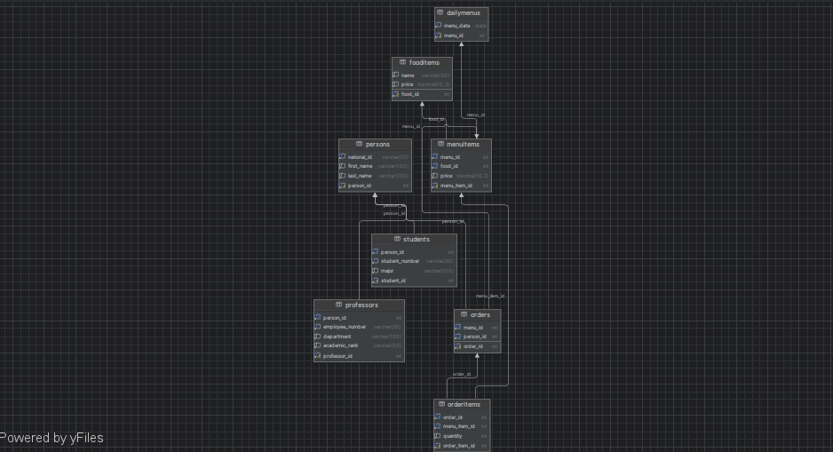

Student Food Ordering System - Database Design

Project Description
A database system for a university food ordering platform where students and professors can order meals from the daily menu.

Database Design Overview

1.Persons Table
Purpose: Stores basic information about all individuals in the system (both students and professors).
Key Features:
Contains fundamental personal data (national ID, first name, last name)
Serves as the central identity table for the system
Uses person_id as an auto-incrementing primary key
national_id has a unique constraint to prevent duplicates

2.Students Table
Purpose: Stores student-specific information that extends the base person data.
Key Features:
Contains student number and major fields
Has a one-to-one relationship with the Persons table via person_id foreign key
student_number is unique to ensure no duplicate student records
Inherits personal details from the Persons table through the relationship

3.Professors Table
Purpose: Stores professor-specific information that extends the base person data.
Key Features:
Contains employee number, department, and academic rank fields
Has a one-to-one relationship with the Persons table via person_id foreign key
employee_number is unique to ensure no duplicate professor records
Captures academic-specific information not relevant to students

4.FoodItems Table
Purpose: Maintains a master list of all possible food items available in the system.
Key Features:
Stores basic food information (name and base price)
Serves as reference data for menu items
Designed to prevent food item duplication across menus

5.DailyMenus Table
Purpose: Represents each day's menu offering with a unique date.
Key Features:
menu_date is unique to ensure only one menu per day
Acts as a container for multiple menu items through the MenuItems table
Enables tracking of menu offerings by date

6.MenuItems Table
Purpose: Links food items to specific daily menus with possible price variations.
Key Features:
Creates a many-to-many relationship between DailyMenus and FoodItems
Allows for price adjustments specific to each menu (different from base food price)
Unique constraint on menu_id and food_id prevents duplicate items in a menu

7.Orders Table
Purpose: Records each order placed by a person for a specific menu.
Key Features:
Links a person to a specific daily menu
Serves as the parent record for order items
Enables tracking of who ordered from which menu

8.OrderItems Table
Purpose: Contains the individual food items that make up each order.
Key Features:
Records specific menu items ordered with quantities
Links to both the parent order and the menu item
Allows for multiple items per order through this relationship table

Database Design Notes:
Normalization: The design follows 3NF with:
All tables have primary keys
No partial key dependencies
No transitive dependencies

Relationships:
Persons have optional one-to-one relationships with Students and Professors
DailyMenus have one-to-many relationships with MenuItems
Orders have one-to-many relationships with OrderItems

